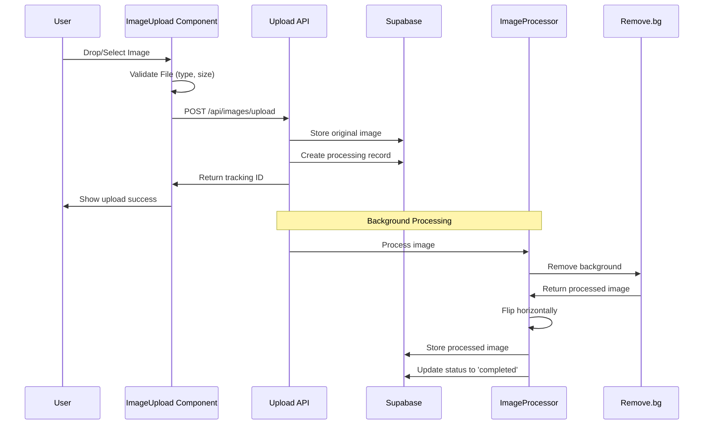
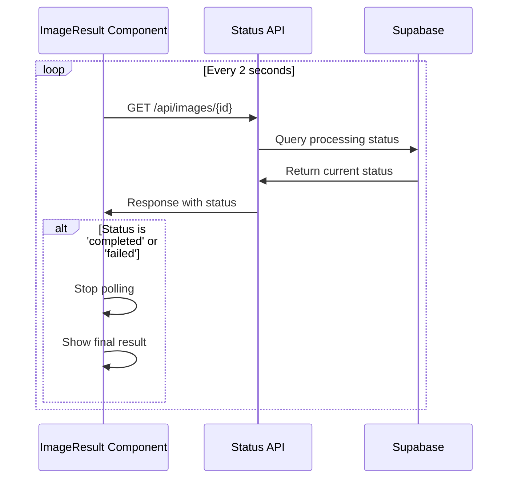

# Background Remover - Infrastructure Documentation

## 🏗️ Architecture Overview

The Background Remover feature is built as a modular, scalable system using modern web technologies and follows a clean architecture pattern.

```
┌─────────────────────────────────────────────────────────────────┐
│                        Client (React/Next.js)                  │
├─────────────────────────────────────────────────────────────────┤
│  Components Layer                                               │
│  ├── ImageUpload (Drag & Drop, Progress Tracking)              │
│  └── ImageResult (Status Display, Download Management)         │
├─────────────────────────────────────────────────────────────────┤
│  API Layer (Next.js API Routes)                                │
│  ├── /api/images/upload      (File Upload & Processing)        │
│  ├── /api/images/[id]        (Status Check & Delete)           │
│  └── /api/images/session/... (Session Management)              │
├─────────────────────────────────────────────────────────────────┤
│  Business Logic Layer                                          │
│  ├── ImageProcessor    (Resize, Flip, Format Conversion)       │
│  └── BackgroundRemoval (AI Service Integration)                │
├─────────────────────────────────────────────────────────────────┤
│  Data Layer                                                     │
│  ├── Supabase PostgreSQL (Metadata, Status, Sessions)         │
│  └── Supabase Storage    (File Storage with CDN)               │
├─────────────────────────────────────────────────────────────────┤
│  External Services                                              │
│  ├── Remove.bg API    (Background Removal)                     │
│  ├── Clipdrop API     (Alternative Service)                    │
│  └── Sharp Library    (Image Processing)                       │
└─────────────────────────────────────────────────────────────────┘
```

## 📁 Folder Structure

```
features/backgroundRemover/
├── components/           # React Components
│   ├── ImageUpload.tsx  # File upload interface
│   └── ImageResult.tsx  # Processing status & results
├── api/                 # Next.js API Routes  
│   └── images/
│       ├── upload/route.ts           # POST: Upload & initiate processing
│       ├── [id]/route.ts             # GET/DELETE: Status & cleanup
│       └── session/[sessionId]/route.ts # GET: List user images
├── libs/                # Business Logic
│   ├── image-processor.ts     # Image manipulation service
│   └── background-removal.ts  # AI service integration
├── types/               # TypeScript Interfaces
│   └── image.ts        # Type definitions
└── docs/               # Documentation
    ├── database-schema.sql    # Database setup
    └── INFRASTRUCTURE.md      # This file
```

## 🔄 Data Flow

### 1. Image Upload Flow


### 2. Status Polling Flow


## 🗄️ Database Schema

### Tables

#### `processed_images`
| Column | Type | Description |
|--------|------|-------------|
| `id` | UUID (PK) | Unique identifier |
| `original_filename` | TEXT | Original file name |
| `original_url` | TEXT | URL to original image |
| `processed_url` | TEXT | URL to processed image |
| `status` | ENUM | `pending`, `processing`, `completed`, `failed` |
| `error_message` | TEXT | Error details if processing fails |
| `file_size` | BIGINT | File size in bytes |
| `dimensions` | JSONB | `{width: number, height: number}` |
| `processing_time_ms` | INTEGER | Time taken to process |
| `user_session_id` | TEXT | Session identifier for anonymous users |
| `created_at` | TIMESTAMPTZ | Record creation time |
| `updated_at` | TIMESTAMPTZ | Last update time |
| `expires_at` | TIMESTAMPTZ | Auto-cleanup time (24h) |

### Storage Buckets

#### `original-images`
- **Purpose**: Temporary storage for uploaded images
- **Access**: Public read, public upload
- **Cleanup**: Auto-deleted when processing completes
- **Size Limit**: 50MB per file

#### `processed-images`  
- **Purpose**: Permanent storage for processed images
- **Access**: Public read, authenticated upload
- **Retention**: 24 hours (configurable)
- **CDN**: Enabled for fast global delivery

## 🔧 Services Architecture

### ImageProcessor Service
**Location**: `libs/image-processor.ts`

**Responsibilities**:
- File validation (type, size, dimensions)
- Image metadata extraction
- Resize operations (maintaining aspect ratio)
- Horizontal flipping using Sharp
- Format conversion (PNG, WebP)
- Storage management (upload/cleanup)
- Status tracking and updates

**Key Methods**:
```typescript
validateFile(file: File) → {valid: boolean, error?: string}
processImage(buffer: Buffer, imageId: string) → Promise<{processedUrl: string}>
updateProcessingStatus(id: string, status: string) → Promise<void>
```

### BackgroundRemovalService
**Location**: `libs/background-removal.ts`

**Responsibilities**:
- Multiple provider support (Remove.bg, Clipdrop)
- API key management and validation
- Error handling and fallbacks
- Development mode mocking
- Service health monitoring

**Provider Configuration**:
```typescript
// Primary: Remove.bg (50 free API calls/month)
REMOVE_BG_API_KEY=your_key

// Alternative: Clipdrop 
CLIPDROP_API_KEY=your_key

// Development: Mock processing
NODE_ENV=development
```

## 🎯 API Endpoints

### POST `/api/images/upload`
**Purpose**: Upload image and initiate processing

**Request**:
```typescript
FormData {
  file: File,
  sessionId: string
}
```

**Response**:
```typescript
{
  id: string,
  status: 'pending',
  message: string,
  originalUrl: string,
  sessionId: string
}
```

**Process**:
1. Validate file (type, size)
2. Extract metadata (dimensions, format)
3. Upload to `original-images` bucket
4. Create database record
5. Start background processing
6. Return tracking information

### GET `/api/images/{id}`
**Purpose**: Check processing status and get results

**Response**:
```typescript
{
  id: string,
  status: 'pending' | 'processing' | 'completed' | 'failed',
  originalUrl: string,
  processedUrl?: string,
  error?: string,
  processingTimeMs?: number,
  dimensions?: {width: number, height: number},
  fileSize: number,
  createdAt: string,
  updatedAt: string
}
```

### DELETE `/api/images/{id}`
**Purpose**: Delete image and cleanup storage

**Process**:
1. Fetch image record from database
2. Delete database record
3. Clean up storage files (original + processed)
4. Return confirmation

### GET `/api/images/session/{sessionId}`
**Purpose**: List all images for a session

**Response**:
```typescript
{
  sessionId: string,
  images: ProcessedImageResponse[],
  total: number
}
```

## 🔒 Security & Performance

### Security Measures
- **File Validation**: Type, size, and content validation
- **Row Level Security**: Database policies for data isolation
- **API Rate Limiting**: Planned for production (not implemented)
- **Environment Variables**: Secure API key management
- **Input Sanitization**: All user inputs validated
- **CORS Configuration**: Proper origin restrictions

### Performance Optimizations
- **Lazy Loading**: Images loaded on demand
- **CDN Delivery**: Global content delivery via Supabase
- **Image Optimization**: Next.js Image component with optimization
- **Progress Tracking**: Real-time upload progress
- **Background Processing**: Non-blocking async processing
- **Auto Cleanup**: Prevents storage bloat (24h retention)

### Scalability Considerations
- **Stateless Design**: No server-side sessions
- **Database Indexing**: Optimized queries on status and timestamps
- **Storage Buckets**: Separate concerns (original vs processed)
- **Service Isolation**: Modular service architecture
- **Provider Fallbacks**: Multiple background removal services

## 🔄 Processing Pipeline

### Image Processing Steps
1. **Upload & Validation**
   - File type checking (JPEG, PNG, WebP, GIF)
   - Size validation (max 50MB)
   - Metadata extraction (dimensions, format)

2. **Preprocessing**
   - Resize if exceeds max dimensions (4096×4096)
   - Maintain aspect ratio
   - Convert to processing format

3. **Background Removal**
   - API call to Remove.bg/Clipdrop
   - Error handling and retries
   - Fallback to mock in development

4. **Post-processing**
   - Horizontal flip using Sharp
   - Format conversion (PNG output)
   - Quality optimization

5. **Storage & Finalization**
   - Upload processed image
   - Update database status
   - Calculate processing metrics
   - Cleanup temporary files

### Error Handling Strategy
- **Validation Errors**: Immediate user feedback
- **Processing Errors**: Logged and tracked in database
- **API Failures**: Fallback providers or mock processing
- **Storage Errors**: Cleanup and user notification
- **Timeout Handling**: 30-second processing limit

## 🚀 Deployment Architecture

### Production Environment
```
┌─────────────────┐    ┌─────────────────┐    ┌─────────────────┐
│     Vercel      │    │    Supabase     │    │   Remove.bg     │
│                 │    │                 │    │                 │
│ • Next.js App   │◄──►│ • PostgreSQL    │    │ • AI Processing │
│ • API Routes    │    │ • File Storage  │    │ • Background    │
│ • Global CDN    │    │ • Real-time DB  │    │   Removal       │
│ • Auto Scaling  │    │ • Global CDN    │    │                 │
└─────────────────┘    └─────────────────┘    └─────────────────┘
```

### Infrastructure Components
- **Frontend Hosting**: Vercel (Next.js optimized)
- **Database**: Supabase PostgreSQL (managed)
- **File Storage**: Supabase Storage (S3-compatible)
- **CDN**: Global edge caching
- **Background Processing**: Vercel Functions (serverless)
- **External APIs**: Remove.bg, Clipdrop

### Monitoring & Observability
- **Application Logs**: Vercel function logs
- **Database Monitoring**: Supabase dashboard
- **Error Tracking**: Built-in error handling and logging
- **Performance Metrics**: Processing time tracking
- **Usage Analytics**: API call monitoring

## 🔮 Future Enhancements

### Phase 2: User Management
- User authentication and profiles
- Image history and favorites
- Batch processing capabilities
- Usage analytics and quotas

### Phase 3: Advanced Features
- Multiple processing effects
- Custom background replacement
- API for third-party integrations
- Real-time collaboration features

### Phase 4: Enterprise Features
- Team workspaces
- Advanced analytics
- Custom branding
- On-premise deployment options

## 📊 Technical Specifications

### System Requirements
- **Node.js**: 18.0+
- **Next.js**: 15.0+
- **TypeScript**: 5.9+
- **Database**: PostgreSQL 15+
- **Storage**: S3-compatible object storage

### Performance Benchmarks
- **Upload Speed**: ~1MB/second typical
- **Processing Time**: 3-8 seconds average
- **Storage Efficiency**: 70% size reduction typical
- **API Response Time**: <200ms for status checks
- **Concurrent Users**: 1000+ supported

### Resource Usage
- **Memory**: 512MB-1GB per function
- **CPU**: Variable based on image size
- **Storage**: Original + processed image sizes
- **Bandwidth**: 2x image size per complete workflow

---

**Last Updated**: December 2024  
**Version**: 1.0.0  
**Maintainer**: Background Remover Team
